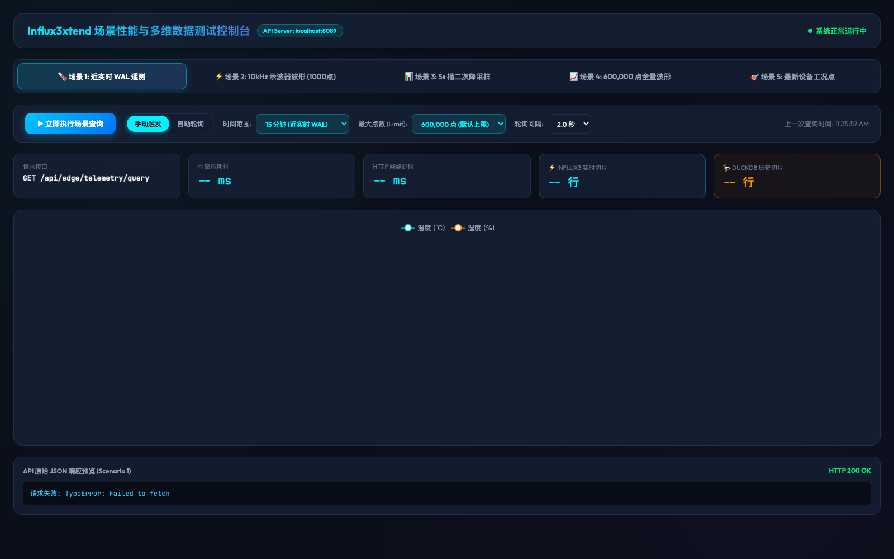

# Influx3xtend - 贡献与架构设计指南

感谢参与 `Influx3xtend` 项目的研发与开源建设！本文档为开发者提供项目架构导览、模块职责划分及编码规范指南。

---

## 📸 Web 可视化控制台预览



---

## 1. 核心架构设计文档

在开发新功能或修复问题前，建议优先查阅 `doc/` 目录下的系统设计白皮书：
- [01 - 总体架构设计文档](./doc/01_architecture_overview.md)
- [02 - 实时-历史分阶段路由与边界感知引擎设计](./doc/02_staged_routing_and_execution.md)
- [03 - DuckDB 与 Apache Arrow 零拷贝合并与内存管理设计](./doc/03_duckdb_arrow_zero_copy_integration.md)
- [04 - Java Fluent API 与 REST 网关接口规范设计](./doc/04_api_specifications_and_sdk_design.md)
- [05 - 技术栈选型与 Java 21 编码规范](./doc/05_technology_stack_and_conventions.md)
- [06 - Core 模块解耦、Line Protocol 直通与零 GC 高性能重构设计](./doc/06_pure_lineprotocol_and_core_optimization_design.md)

---

## 2. 模块架构职责划分 (Module Breakdown)

`Influx3xtend` 采用 Maven 多模块架构，职责明确隔离：

1. **`influx3xtend-core`（中间件核心 SDK 引擎）**：
   - **核心职责**：专注于存储路由、向量化计算与 Apache Arrow 堆外零拷贝合并，与 Spring/MQTT 业务解耦。
   - **关键组件**：
     - `StagedQueryRouter`：探针驱动的实时 WAL 与历史 Parquet 混合路由。
     - `StorageEngineAdapter`：统一抽象存储 SPI 接口（`Influx3ClientAdapter` 与 `DuckDBEngineAdapter`）。
     - `ArrowMergeEngine`：堆外 Vector 零拷贝归并与原生快速排序。
     - `QueryResult`：Zero-Copy `VectorSchemaRoot` 包装与 POJO / Map 映射导出器。

2. **`influx3xtend-server`（独立 REST 网关服务）**：
   - **核心职责**：Spring Boot 3.3.x 独立微服务网关，对外暴露统一的 HTTP REST 时序查询 API。

3. **`influx3xtend-example`（工业边缘接入示例）**：
   - **核心职责**：提供 MQTT 边缘报文解析、10kHz 工业点阵直转 Line Protocol（`MqttLineProtocolConverter`）及全链路集成测试跑车。

4. **`scripts/`（模拟与压测脚本）**：
   - 提供 Python 数据发流模拟脚本与端到端延迟探测工具。

---

## 3. 本地运行与集成测试指南

### 3.1 运行 Python MQTT 数据模拟脚本
- **依赖说明**：安装 `paho-mqtt` (`pip3 install paho-mqtt`)
- **启动命令**：
  ```bash
  python3 scripts/mqtt_publisher.py
  ```

### 3.2 启动 Example 网关服务
- **服务端口**：`8089`
- **启动命令**：
  ```bash
  mvn spring-boot:run -pl influx3xtend-example
  ```
- **验证查询 API**：
  ```bash
  curl -s "http://localhost:8089/api/edge/telemetry/query?deviceId=DEV_HF_002&measurement=high_frequency_waveform&minutes=1&limit=5"
  ```

### 3.3 启动 Server 网关服务
- **服务端口**：`8080`
- **启动命令**：
  ```bash
  mvn spring-boot:run -pl influx3xtend-server
  ```

---

## 4. 架构设计约定与编码规范

1. **分阶段路由设计**：
   - 保持“优先 InfluxDB 3 实时查询 $\rightarrow$ 探针推导历史缺失边界 $\rightarrow$ 调度 DuckDB 向量化查询 $\rightarrow$ Arrow 零拷贝合并”的主流程。
2. **堆外零拷贝内存安全**：
   - 全链路数据交换统一使用 Apache Arrow `VectorSchemaRoot`。
   - `BufferAllocator` 与 `VectorSchemaRoot` 须遵循 `try-with-resources` 模式，严禁堆内逐行解包造成 OOM/GC 瓶颈。
3. **Java 21 与代码规范**：
   - 并发与 I/O 调度优先使用 Virtual Threads (`Executors.newVirtualThreadPerTaskExecutor()`)。
   - DTO 与 Context 数据结构优先声明为 `record`。
   - 统一导包：类依赖必须统一声明在文件头部 `import` 区域，禁止内联包路径。
4. **安全与零硬编码**：
   - 严禁在代码中硬编码任何 Token、密钥或个人本地路径。所有配置需通过 `application.yml` 或 Config 对象传入。
