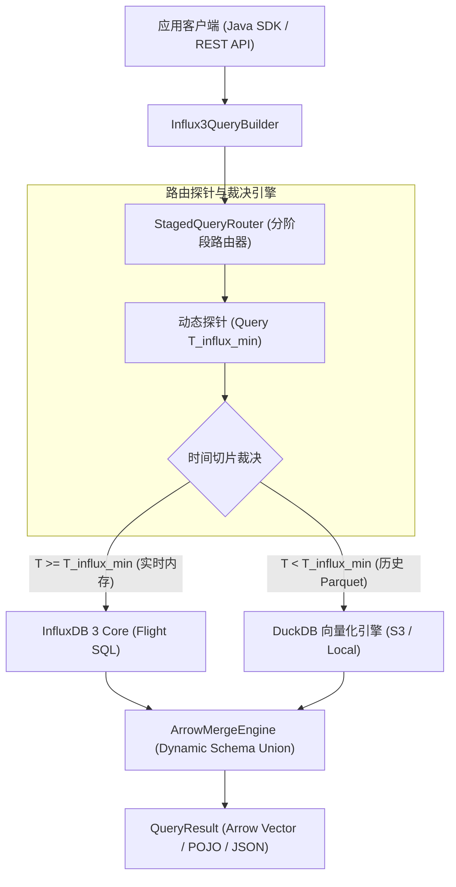

# Influx3xtend - 增强版 InfluxDB 3 工业级 Java SDK 与统一网关中间件

[](https://org.openjdk.java.net/)
[](https://arrow.apache.org/)
[](https://duckdb.org/)
[](LICENSE)

`Influx3xtend` 是专为开源社区版 **InfluxDB 3 Core** 打造的**高性能、高可用、透明增强 Java SDK 与独立 Gateway 中间件**。它成功打破了开源版 InfluxDB 3 Core 在单次 Flight SQL 扫描中存在的文件数/时间视窗原生限制（如 ~432 个 Parquet 文件 / 72 小时限制），实现了 **“InfluxDB 3 实时内存 + DuckDB 历史 Parquet 零拷贝合并”** 的无缝超长历史时序查询体验！

---

## 🌟 核心特性与架构亮点

1. **🚀 动态探针驱动下推 (Dynamic Probe-Driven Routing)**
   - 摒弃硬编码时间判决，自动探针 InfluxDB 3 内存实际最老点 $T_{influx\_min}$。比 $T_{influx\_min}$ 更早的切片 100% 下推给 DuckDB 扫描 Parquet，视窗跨度无限扩展！
2. **⚡ Apache Arrow 堆外零拷贝合并 (Zero-Copy Merge Engine)**
   - 全链路使用 `VectorSchemaRoot` 进行数据交换，基于 **Dynamic Schema Union** 算法实现实时与历史批次的极速堆外合并，GC 负担为零。
3. **🏭 10kHz 高频工业数据接入 (10kHz Physical Rate Ingestion)**
   - 结合 Java 21 虚拟线程 (Virtual Threads) 与微秒级向量解包，支持每秒 >20,000 采样点的大吞吐连续采集与上报。
4. **🔌 泛型自适应与无硬编码 Schema**
   - MQTT 报文支持 `Promoted Wide Types` (Int32, Double, Utf8) 动态推断；QueryResult 支持 POJO 自适应注解映射与无模版 Map/JSON 导出。

---

## 🏛️ 系统总体架构图



---

## 🖥️ 前端场景性能与多维数据测试控制台

项目自带内置的暗黑科技风工业物联网与 OLAP 性能测试控制台（集成 ECharts 5 极速降采样与 dataZoom 缩放）：


---

## 🚀 快速运行与测试指南 (Quick Run Guide)

### 1. 零配置启动内置 Web 控制台与 REST 示例网关
执行以下命令启动 Spring Boot 示例服务（默认监听 `8089` 端口）：
```bash
mvn spring-boot:run -pl influx3xtend-example
```
启动成功后，直接用浏览器访问：
👉 **`http://localhost:8089`**

### 2. 发送 HTTP REST 测试查询
```bash
# 查询高频设备 1 分钟内的实时 telemetry 数据
curl -s "http://localhost:8089/api/edge/telemetry/query?deviceId=DEV_HF_002&measurement=high_frequency_waveform&minutes=1&limit=5"
```

### 3. 运行项目单元测试套件
```bash
# 运行全量单元测试
mvn clean test

# 仅运行核心归并引擎单元测试
mvn test -pl influx3xtend-core
```

### 4. 🔑 动态传入 Token（可选）
如果您需要指定自己的 InfluxDB 3 Token，可通过环境变量或命令行参数传入：
```bash
# 方式 A: 环境变量
export INFLUXDB3_TOKEN="apiv3_your_token..."

# 方式 B: Maven 命令行参数
mvn test -DINFLUXDB3_TOKEN="apiv3_your_token..."
```

---

## ⚡ 快速上手 (Quick Start)

### 1. 引入 Maven 依赖

```xml
<dependency>
    <groupId>org.influx3xtend</groupId>
    <artifactId>influx3xtend-core</artifactId>
    <version>1.0.0-SNAPSHOT</version>
</dependency>
```

### 2. 初始化客户端与链式查询

```java
import org.influx3xtend.core.api.Influx3xtendClient;
import org.influx3xtend.core.config.InfluxDB3Config;
import org.influx3xtend.core.config.S3StorageConfig;
import org.influx3xtend.core.model.QueryResult;

import java.time.Duration;
import java.time.Instant;
import java.util.List;

public class App {
    public static void main(String[] args) {
        // 1. 创建通用中间件客户端
        try (Influx3xtendClient client = Influx3xtendClient.builder()
                .influx3Config(InfluxDB3Config.builder()
                        .host("http://localhost:8181")
                        .token("YOUR_INFLUXDB3_TOKEN")
                        .database("tsdb")
                        .build())
                .storageConfig(S3StorageConfig.builder()
                        .bucket("node0")
                        .endpoint("http://localhost:8181")
                        .build())
                .duckdbMaxMemory("4GB")
                .build()) {

            // 2. 发起跨冷热历史数据的超长流式查询
            try (QueryResult result = client.query()
                    .measurement("daq_card_a_10khz")
                    .whereTag("card_id", "DAQ_CARD_A")
                    .timeRange(Instant.now().minus(Duration.ofDays(30)), Instant.now())
                    .limit(100)
                    .execute()) {

                System.out.println("Returned Rows: " + result.getRowCount());
                System.out.println("Execution Time: " + result.getExecutionTimeMs() + " ms");

                // 导出为 Map 列表 (适合透明 JSON 响应)
                var mapList = result.toMapList();
            }
        }
    }
}
```

---

## 📊 模块说明

| 模块名称 | 作用 |
| :--- | :--- |
| **`influx3xtend-core`** | 核心 SDK、Staged Router、DuckDB 适配器与 Arrow 归并引擎 |
| **`influx3xtend-server`** | 独立 Spring Boot 3 Gateway HTTP REST 服务器 |
| **`influx3xtend-example`** | 10kHz 高频压测与 6 大极端边界条件测试集 |

---

## 📜 开源协议

本项目采用 [Apache License 2.0](LICENSE) 协议开源。
