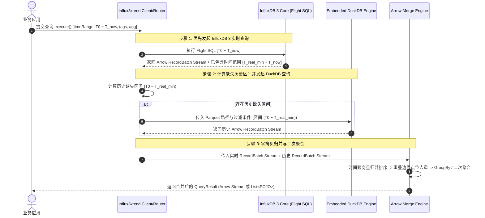

# Influx3xtend 总体架构设计文档

## 1. 系统定位与核心价值

**Influx3xtend** 是一款基于 **Java 21** 开发的高性能时序与 OLAP 混合数据架构中间件。它通过充分结合 **InfluxDB 3 Core** 的实时内存/WAL高性能处理能力与 **DuckDB** 对落盘 Parquet 历史数据的向量化分析能力，为企业级大规模时序与列式数据分析提供统一、高效、平滑的查询与路由解决方案。

### 1.1 核心痛点与解决思路
在传统的时序/OLAP 存储架构中：
- **实时数据写入与查询**：频繁写入的最新数据通常驻留在 InfluxDB 3 Core 的 WAL 和内存 Buffer 中，尚未持久化或未生成极佳压缩率的 Parquet 文件。
- **历史海量数据查询**：已落盘的 Parquet 文件如果全部强依赖 InfluxDB 3 Core 节点的 DataFusion 执行引擎查询，不仅会带来高昂的计算节点扩容成本，而且难以灵活支持客户端本地嵌入式计算或跨多 S3 存储桶的轻量查询。
- **混合查询割裂**：跨越“实时未落盘”与“历史已落盘”时间范围的查询往往需要业务方自行编写代码分别查两个系统再在内存中手写拼接。

**Influx3xtend 的解耦方案**：
1. **优先实时 (InfluxDB 3 First)**：首先向 InfluxDB 3 Core 查询实时/未落盘数据切片；
2. **感知边界与透明兜底**：根据 InfluxDB 3 Core 返回的数据最大/最小时间戳与落盘状态，确定未被 InfluxDB 3 覆盖的历史时间区间；
3. **DuckDB 向量化直连**：针对历史区间，由嵌入式 DuckDB (JNI) 挂载 `httpfs`/`parquet` 扩展直连 S3/OSS/本地 Parquet 文件执行高性能向量化查询；
4. **Apache Arrow 零拷贝合并**：在 JVM 内存中基于 Apache Arrow 统一数据格式进行高效去重、归并排序与二次聚合，对外提供统一的视图。

---

## 2. 整体系统架构图

```
+-----------------------------------------------------------------------------------+
|                                 业务应用 / 客户端                                   |
|   (Java App 引入 influx3xtend-core / HTTP 访问 influx3xtend-server Gateway)         |
+-----------------------------------------+-----------------------------------------+
                                          |
                                          v
+-----------------------------------------------------------------------------------+
|                              Influx3xtend Client API                              |
|                    (Fluent Query Builder & POJO / Arrow Mapper)                   |
+-----------------------------------------+-----------------------------------------+
                                          |
                                          v
+-----------------------------------------------------------------------------------+
|                        Staged Routing Engine (分阶段路由引擎)                        |
|                                                                                   |
|  [阶段 1] 实时查询                 [阶段 2] 边界感知            [阶段 3] 历史查询      |
|  向 InfluxDB 3 发起 Flight SQL    推算未涵盖历史切片区间        调度 DuckDB 向量化引擎    |
+------------------+----------------------+-------------------+---------------------+
                   |                      |                   |
                   v                      v                   v
+------------------+----+     +-----------+---------+     +---+-----------------+
| InfluxDB 3 Core Client|     | S3/Object Store     |     | Embedded DuckDB     |
| (com.influxdb:        |     | Manifest & Parquet  |     | Engine (JNI)        |
|  influxdb3-java)      |     | File Range Index    |     | (org.duckdb_jdbc)   |
+------------------+----+     +-----------+---------+     +---+-----------------+
                   |                      |                   |
                   \------------------+---|-------------------/
                                      |   |
                                      v   v
+-----------------------------------------------------------------------------------+
|                        Arrow Vector Merge Engine (内存合并引擎)                     |
|        (Zero-Copy Timestamp Deduplication / Mergesort / Second Aggregation)        |
+-----------------------------------------+-----------------------------------------+
                                          |
                                          v
+-----------------------------------------------------------------------------------+
|                             QueryResult (Arrow Stream / POJO)                     |
+-----------------------------------------------------------------------------------+
```

---

## 3. Maven 工程模块划分

系统采用多模块构建，保证既可以作为 SDK 被嵌入使用，也能独立部署为 Gateway 服务：

```
Influx3xtend/
├── pom.xml                               # Root POM (统一版本管理: Java 21, Spring Boot 3.3+, Arrow 18+, DuckDB 1.x)
├── influx3xtend-core/                    # 核心 SDK 模块 (Jar 包)
│   ├── src/main/java/org/influx3xtend/core/
│   │   ├── api/                          # 流式 Query Builder API
│   │   ├── client/                       # InfluxDB 3 Core 官方 SDK 包装与 Flight SQL 管理
│   │   ├── duckdb/                       # 嵌入式 DuckDB (JNI) 连接池与 SQL 下推生成器
│   │   ├── router/                       # 实时/历史切片分阶段路由器与边界感知器
│   │   ├── engine/                       # 基于 Arrow Vector 的归并去重与二次聚合算子
│   │   └── model/                        # 结构化 Request/Response & POJO 映射器
├── influx3xtend-server/                  # 独立 Gateway 网关模块 (Spring Boot 应用程序)
│   ├── src/main/java/org/influx3xtend/server/
│   │   ├── controller/                   # REST / Gateway HTTP 端点
│   │   ├── config/                       # Spring 自动配置与 Bean 装配
│   │   └── service/                      # 网关业务与路由管理
└── influx3xtend-example/                 # 示例与性能 Benchmark
```

---

## 4. 关键交互流程与生命周期

### 4.1 查询请求生命周期图


---

## 5. 核心非功能性要求 (NFRs)

1. **高性能与低延迟**：
   - 依赖 Apache Arrow 内存格式实现 DuckDB 与 InfluxDB 3 查询结果的零拷贝传输与归并。
   - 充分使用 Java 21 虚拟线程 (Virtual Threads)，在高并发网关查询时不造成传统 OS 线程阻塞。
2. **强一致性与去重保证**：
   - 当 InfluxDB 3 实时 WAL 未落盘数据与历史 Parquet 在交界时间点发生交叠时，通过基于时间戳与 Tag 唯一标识的双指针去重，保证结果无重复无遗漏。
3. **透明兜底与容错**：
   - 若 Object Store 历史文件扫描短时间不可用或不存在 Parquet 文件，能够优雅透明兜底全量由 InfluxDB 3 尝试响应。
