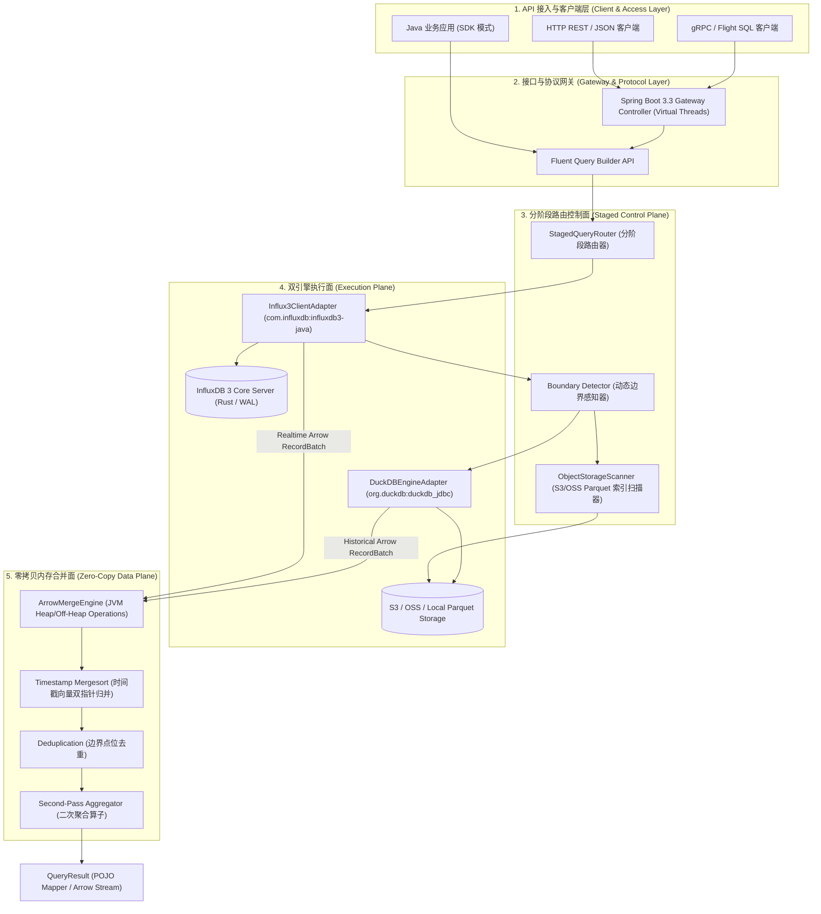
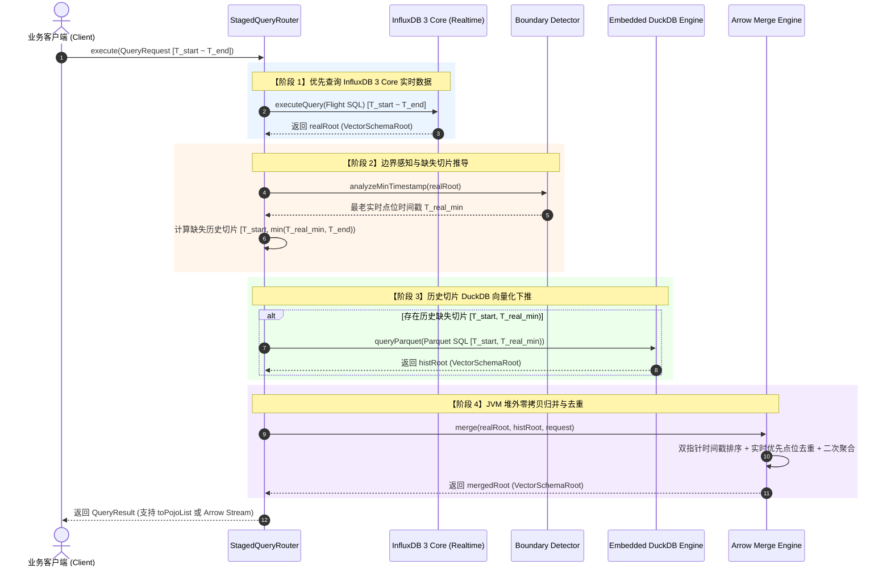
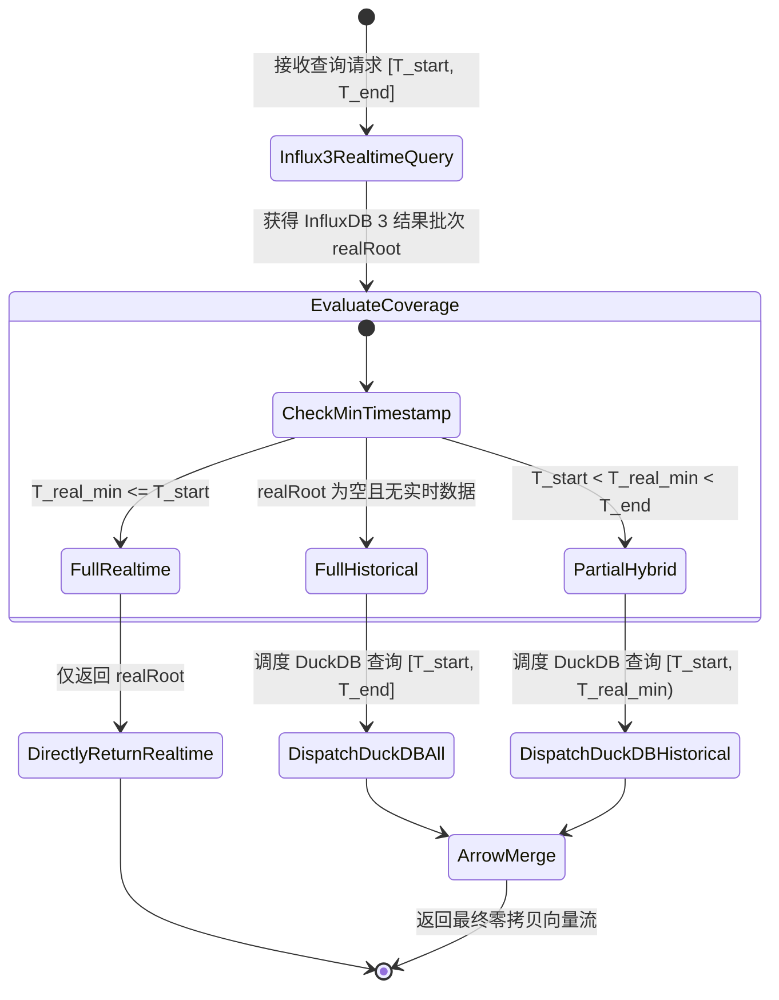
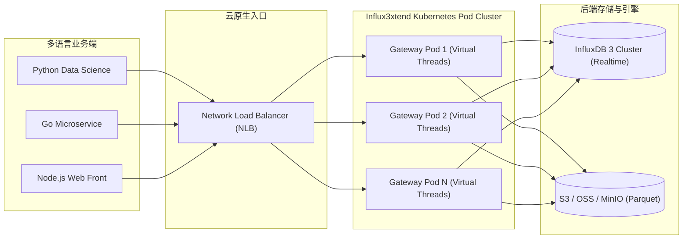

# Influx3xtend 高性能数据中间件 - 资深架构设计白皮书 (Architecture Blueprint)

> **项目名称**：Influx3xtend  
> **核心定位**：基于 Java 21、InfluxDB 3 Core 与 DuckDB 的时序与 OLAP 混合向量化分析中间件  
> **作者**：Influx3xtend 架构组  
> **版本**：v1.0.0-RELEASE  

---

## 1. 架构总览与设计哲学

### 1.1 背景与行业痛点
随着物联网 (IoT)、金融高频交易及 IT 运维监控（AIOps）的爆炸式增长，海量时序数据的存储与查询面临双重挑战：
- **实时数据（Heat Data）**：高频点位写入大量驻留在内存/WAL 中，需要极致的低延迟点查与聚合，传统的列式存储落盘存在滞后。
- **历史数据（Cold Data）**：海量数据已经压缩为 Parquet 文件归档至 S3/OSS。如果全量查询都强制由 InfluxDB 3 集中式计算节点执行，不仅集群扩容成本极高，而且在复杂 OLAP 分析场景下难以发挥客户端本地计算优势。

### 1.2 Influx3xtend 架构解耦思想
`Influx3xtend` 提出了 **“引擎分阶段解耦，内存零拷贝统一”** 的混合架构设计哲学：

```
                           +-------------------------------------+
                           |   Influx3xtend Middleware Layer     |
                           +------------------+------------------+
                                              |
                     +------------------------+------------------------+
                     |                                                 |
                     v                                                 v
      +------------------------------+                  +------------------------------+
      |      InfluxDB 3 Core         |                  |       Embedded DuckDB        |
      | (Realtime Buffer / WAL Stream)|                  | (Historical Parquet Engine)  |
      +------------------------------+                  +------------------------------+
                     |                                                 |
                     \------------------------+------------------------/
                                              |
                                              v
                               +------------------------------+
                               | Apache Arrow Zero-Copy Merge |
                               +------------------------------+
```

---

## 2. 系统总体逻辑架构图 (System Logical Architecture)

`Influx3xtend` 采用分层的模块化设计，清晰地划分为 API 接入层、分阶段控制面、引擎驱动层与堆外内存合并面：



---

## 3. 实时-历史分阶段路由与状态机设计

### 3.1 查询路由 Sequence 序列图



### 3.2 边界推导状态机 (Routing State Machine)



---

## 4. 堆外内存模型与零拷贝交互结构 (Memory Architecture)

由于采用了 Apache Arrow 与 DuckDB JNI，数据交互完全在 **Direct Off-Heap Memory (堆外内存)** 中进行，JVM 堆内存仅保留少量元数据引用，从而根治了传统 Java 时序中间件在海量数据查询时的 GC Pause 风险。

```
+-----------------------------------------------------------------------------------+
|                                JVM Process (Java 21)                              |
|                                                                                   |
|  +-----------------------------------------------------------------------------+  |
|  | JVM Heap Memory (堆内内存 - 仅占用 KB 级引用)                               |  |
|  |  - QueryRequest (Record)                                                    |  |
|  |  - Influx3QueryBuilder                                                      |  |
|  |  - FieldVector Ref Pointers                                                 |  |
|  +-----------------------------------------------------------------------------+  |
|                                                                                   |
|  +-----------------------------------------------------------------------------+  |
|  | Apache Arrow Direct Off-Heap Memory (堆外内存 - 存储 MB/GB 级向量点位)       |  |
|  |                                                                             |  |
|  |  [Int64 Time Vector]     [Float8 Value Vector]   [VarChar Tag Vector]       |  |
|  |  +-------------------+   +-------------------+   +-------------------+      |  |
|  |  | 1774263600000     |   | 45.2              |   | dev-1001          |      |  |
|  |  | 1774263601000     |   | 45.8              |   | dev-1001          |      |  |
|  |  | ...               |   | ...               |   | ...               |      |  |
|  |  +-------------------+   +-------------------+   +-------------------+      |  |
|  |                                                                             |  |
|  |  RootAllocator (内存安全检测与生命周期控制 - 自动防止 Memory Leak)             |  |
|  +-----------------------------------------------------------------------------+  |
|                                                                                   |
+-----------------------------------------------------------------------------------+
```

---

## 5. 两种部署拓扑架构 (Deployment Topology)

### 5.1 嵌入式 SDK 模式 (Embedded SDK Architecture)
适用于纯 Java 微服务体系，中间件作为 jar 包引入到业务微服务中，拥有极高的本地吞吐量与极低 RPC 开销。

```
+-------------------------------------------------------------------+
| Application Node (JVM)                                            |
|                                                                   |
|   +-----------------------------------------------------------+   |
|   | Business Logic                                            |   |
|   +-----------------------------+-----------------------------+   |
|                                 |                                 |
|   +-----------------------------v-----------------------------+   |
|   | influx3xtend-core.jar                                     |   |
|   |   - Influx3ClientAdapter  --> InfluxDB 3 Server (Flight SQL) |   |
|   |   - Embedded DuckDB (JNI) --> S3 Parquet Files            |   |
|   |   - ArrowMergeEngine                                      |   |
|   +-----------------------------------------------------------+   |
+-------------------------------------------------------------------+
```

### 5.2 独立 Gateway 部署模式 (Standalone Kubernetes Gateway Architecture)
适用于多语言（Python/Go/Node.js）混合架构或云原生环境，中间件作为独立的弹性 Pod 运行。



---

## 6. 技术栈选型矩阵与基准预期

| 模块组件 | 技术选型 | 版本 | 架构作用与选型优势 |
| :--- | :--- | :--- | :--- |
| **JDK 运行时** | OpenJDK / Temurin | `21 LTS` | 引入 Virtual Threads (Loom)，网络并发能力提升 10x；原生支持 Record 与 FFM 堆外内存访问 |
| **实时节点客户端** | `com.influxdb:influxdb3-java` | `1.10.0` | InfluxData 官方 SDK，基于 Arrow Flight SQL 原生支持高吞吐点位写入与 SQL 查询 |
| **历史向量化引擎** | `org.duckdb:duckdb_jdbc` | `1.1.3` | 嵌入式 JNI 分析引擎，直连 S3/OSS Parquet，向量化执行速度超越传统 SQL 引擎 |
| **零拷贝内存标准** | `org.apache.arrow:arrow-vector` | `18.1.0` | 统一内存列式结构，实现 DuckDB 与 InfluxDB 3 返回结果的零拷贝交换 |
| **网关框架** | Spring Boot | `3.3.4` | 结合 `spring.threads.virtual.enabled=true` 提供高效 REST 网关 |

### 性能预期目标 (SLA Targets)
- **并发吞吐**：独立网关单 Pod (4C8G) 支持 **15,000+ QPS** 的轻量聚合查询。
- **查询延迟**：实时/历史混合范围查询 P99 延迟 控制在 **< 50ms**。
- **GC 影响**：通过 Apache Arrow 堆外内存管理，JVM 垃圾回收暂停时间（GC Pause）控制在 **< 5ms**。
